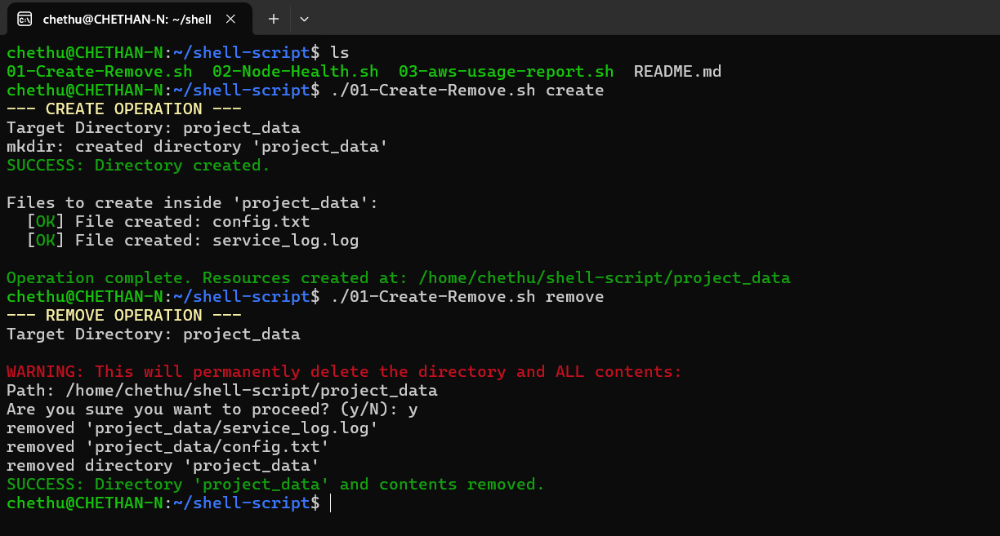
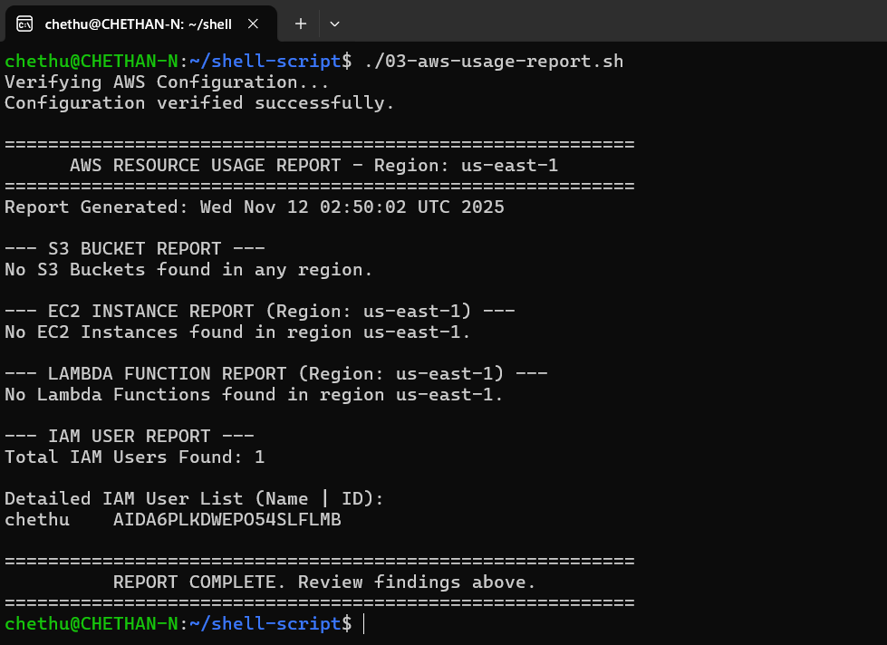

# 🐧 Linux & AWS Shell Scripting Toolkit 🚀

This repository is a practical showcase of professional-grade **Bash shell scripting**, focusing on essential DevOps tasks, system monitoring, and structured cloud resource reporting.

---

## 📂 File Index & Overview

This table provides a quick guide to every script in the repository. **Remember to update this table every time you add a new `.sh` file!**

| File Name | Purpose & Description | Dependencies | Key Features Demonstrated |
| :--- | :--- | :--- | :--- |
| `01-Create-Remove.sh` | **Directory & File Management.** Automates the creation or removal of files and directories based on user input, ensuring paths are handled safely. | None | Input validation, conditional logic (`if/else`), argument parsing. |
| `02-Node-Health.sh` | **Server Health Check.** Advanced Server Health Check. Generates a comprehensive, color-coded report for a server's health, focusing on critical production metrics. | None | Advanced Reporting: Color-coding for alerts (CRITICAL/WARNING), checks for 1, 5, and 15-minute load averages, calculates accurate RAM usage, and logs top CPU/memory consuming processes upon warning. |
| `03-aws-usage-report.sh` | **AWS Resource Usage Report.** Generates a highly detailed, human-readable inventory report for essential AWS services (EC2, S3, IAM, Lambda). | `aws cli`, `jq` | Dependency checking, credential verification (`sts get-caller-identity`), advanced data processing with `jq` and `column -t`. |
| `README.md` | **Repository Guide.** The file you are currently reading, providing context, prerequisites, and usage instructions. | None | Markdown structure and documentation standards. |

---
## Report Output Sample
---
## 01-Create-Remove.sh
This is a sample of the structured, output from the `1-Create-Remove.sh` script:

---
## 02-Node-Health.sh
This is a sample of the structured, output from the `02-Node-Health.sh` script:

---
## 03-aws-usage-report.sh
This is a sample of the structured, output from the `03-aws-usage-report.sh` script:

